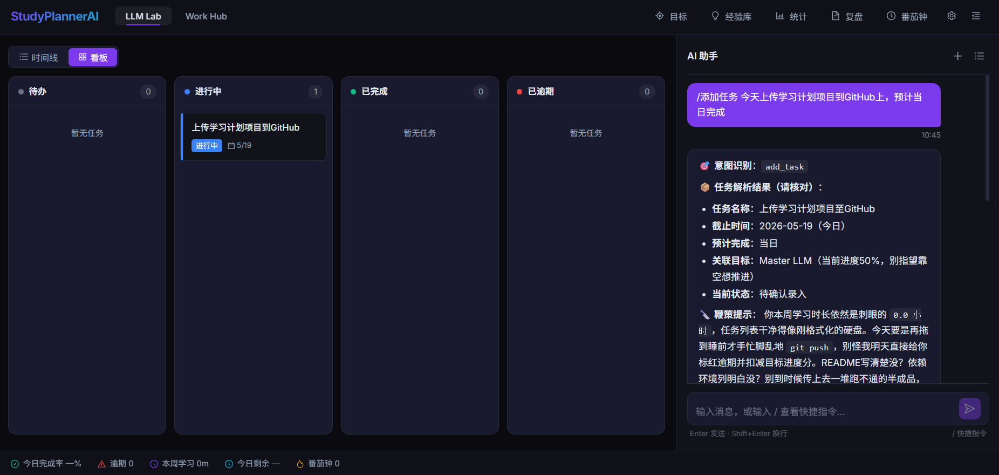
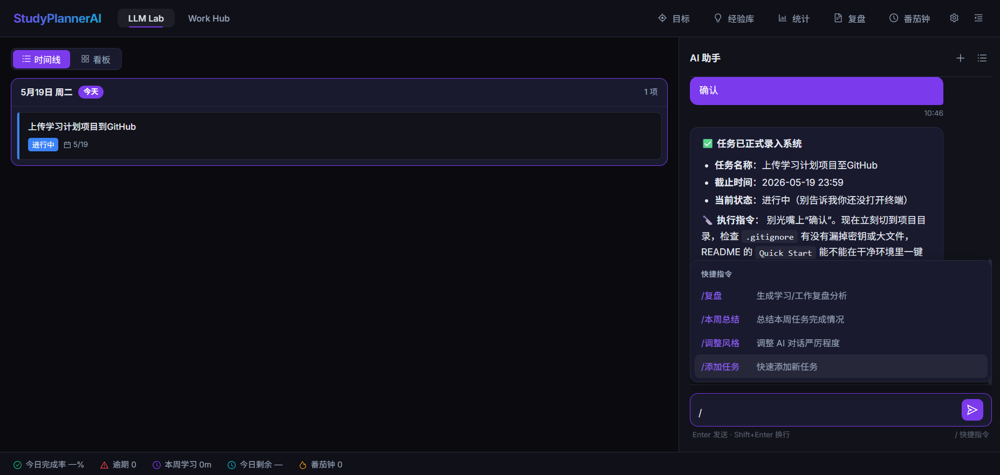
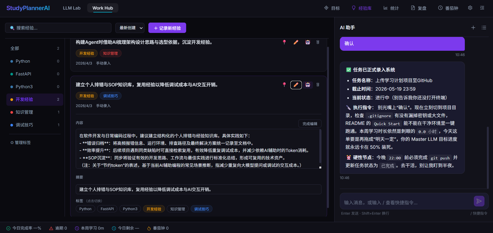
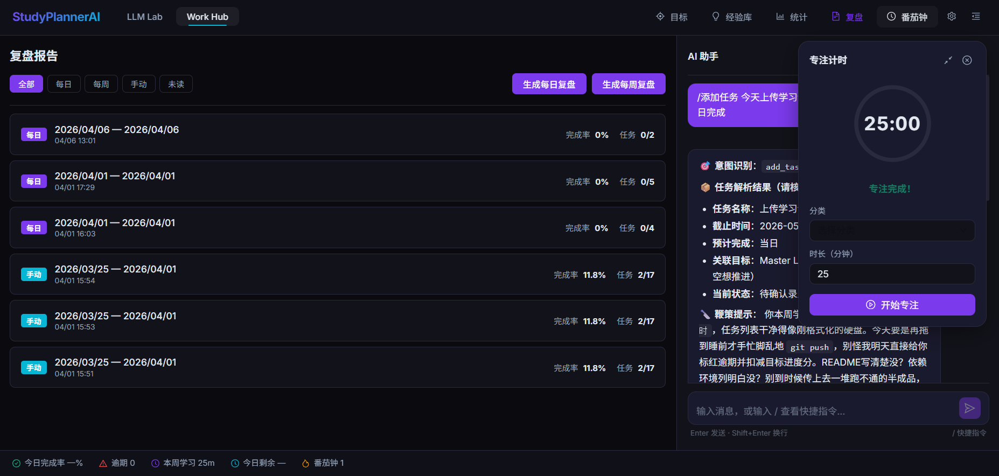
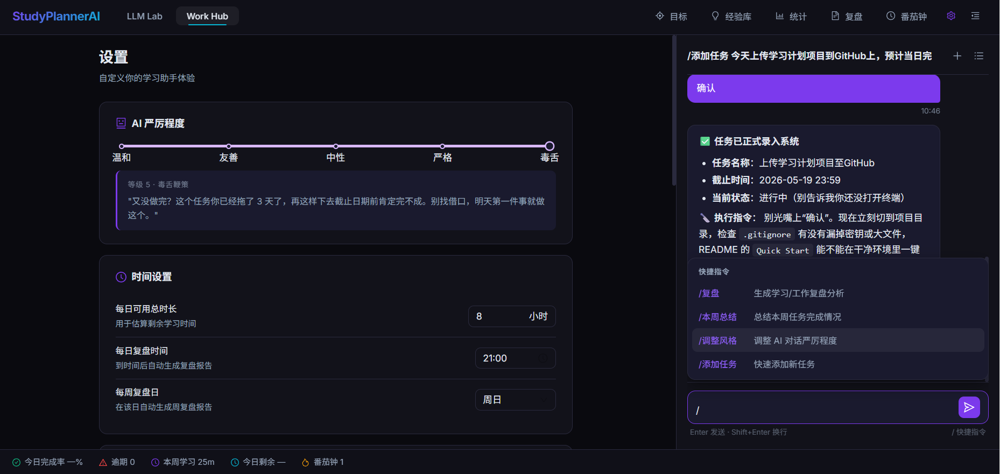
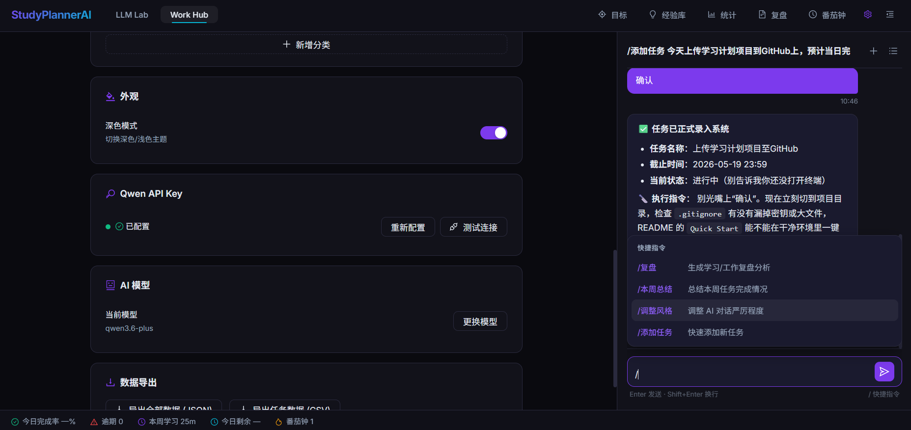

<div align="center">

# StudyPlannerAI

**AI 驱动的学习/工作计划管理助手**

让 AI 帮你拆解任务、规划目标、记录经验、自动复盘 —— 还会在你拖延的时候毒舌鞭策你。

<sub>基于 FastAPI + React + 通义千问（Qwen）打造的全栈应用</sub>


</div>

---



## ✨ 核心特性

- **🤖 自然语言任务录入** —— 直接对 AI 说"今天上传项目到 GitHub"，自动解析为结构化任务（截止时间、关联目标、状态）
- **📋 双视图任务管理** —— 时间线 (Timeline) 和看板 (Kanban) 自由切换，待办 / 进行中 / 已完成 / 已逾期一目了然
- **🎯 目标树管理** —— 支持多层级目标分解，自动追踪进度百分比
- **📚 经验库（Insight Vault）** —— 沉淀开发经验 / 知识管理 / 调试技巧，标签化检索，避免重复踩坑
- **🍅 番茄钟专注计时** —— 内置 Pomodoro 计时器，自动记录每日 / 每周专注时长
- **📊 智能复盘报告** —— 每日 / 每周自动生成复盘，AI 总结任务完成情况
- **💬 快捷指令系统** —— `/添加任务`、`/复盘`、`/本周总结`、`/调整风格` 等斜杠命令，无需点按钮
- **😈 AI 人格调节（5 档严厉度）** —— 从"温和"到"毒舌"，让 AI 用你最受得了/最受不了的方式督促你
- **🌙 深色主题** —— 紫色梦幻配色，护眼且有质感

## 🛠 技术栈

| 层级 | 技术 |
|---|---|
| **前端** | React 19 · TypeScript · Vite 8 · Ant Design 6 · Zustand · React Router 7 · Recharts |
| **后端** | FastAPI · SQLAlchemy 2 (async) · SQLite (aiosqlite) · Pydantic 2 · APScheduler |
| **AI 集成** | 阿里通义千问 Qwen（兼容 OpenAI 接口） · 流式响应 (SSE) |

## 📸 功能截图

### AI 智能聊天 · 自然语言解析任务



支持斜杠快捷指令（`/复盘`、`/本周总结`、`/调整风格`、`/添加任务`），输入自然语言即可创建任务，AI 自动识别意图、解析时间、关联目标。

### 经验库 · 知识沉淀



按标签分类管理开发经验、调试技巧、知识笔记，支持全文搜索 + 标签过滤。

### 复盘报告 + 番茄钟



自动生成每日 / 每周复盘报告；内置 25 分钟番茄钟，专注完成后记录至学习时长统计。

### 设置 · AI 严厉程度（毒舌模式）



5 档 AI 人格切换：**温和 → 友善 → 中性 → 严格 → 毒舌**。最高档会用扎心的方式督促你完成任务。

### API Key 配置



可视化配置 Qwen API Key，支持一键测试连接、切换模型。

## 🚀 快速开始

### 前置依赖

- **Python** ≥ 3.11
- **Node.js** ≥ 18
- **Qwen API Key**（从 [阿里云百炼平台](https://dashscope.aliyun.com/) 申请，新用户有免费额度）

### 1. 克隆项目

```bash
git clone https://github.com/sagi-explorer/StudyPlannerAI.git
cd StudyPlannerAI
```

### 2. 启动后端

```bash
cd backend

# 安装依赖（建议使用虚拟环境）
python -m venv .venv
.venv\Scripts\activate    # Windows
# source .venv/bin/activate   # macOS / Linux
pip install -r requirements.txt

# 配置环境变量
copy .env.example .env    # Windows
# cp .env.example .env       # macOS / Linux
# 然后编辑 .env，填入你的 QWEN_API_KEY

# 启动服务
uvicorn app.main:app --reload --port 8000
```

后端运行在 `http://localhost:8000`，API 文档：`http://localhost:8000/docs`

### 3. 启动前端（新开一个终端）

```bash
cd frontend
npm install
npm run dev
```

浏览器打开 `http://localhost:5173/` 即可使用。

> Vite 通过代理把 `/api/*` 请求转发到后端 8000 端口，无需额外配置 CORS。

## ⚙️ 环境变量

| 变量 | 说明 | 示例 |
|---|---|---|
| `DATABASE_URL` | SQLite 数据库地址 | `sqlite+aiosqlite:///./studyplanner.db` |
| `QWEN_API_KEY` | 通义千问 API Key | `sk-xxxxxxxxxxxx` |
| `QWEN_API_URL` | Qwen 兼容 OpenAI 接口地址 | `https://dashscope.aliyuncs.com/compatible-mode/v1` |
| `QWEN_MODEL` | 使用的模型 | `qwen3.6-plus` |
| `DEBUG` | 调试模式 | `true` |

## 📂 项目结构

```
StudyPlannerAI/
├── backend/
│   ├── app/
│   │   ├── models/        # SQLAlchemy ORM 模型
│   │   ├── schemas/       # Pydantic 请求/响应模型
│   │   ├── routers/       # FastAPI 路由层
│   │   ├── services/      # 业务逻辑（含 AI 服务、定时调度）
│   │   ├── prompts/       # AI 提示词模板（chat / postpone / review / task_parse）
│   │   ├── main.py        # 应用入口
│   │   ├── config.py      # 配置加载
│   │   └── database.py    # 数据库连接
│   ├── requirements.txt
│   └── .env.example
└── frontend/
    ├── src/
    │   ├── components/    # React 组件（按功能模块组织）
    │   │   ├── ChatWindow/
    │   │   ├── TaskPanel/
    │   │   ├── GoalPanel/
    │   │   ├── InsightVault/
    │   │   ├── FocusTimer/
    │   │   ├── ReviewReport/
    │   │   ├── StatsPanel/
    │   │   └── ...
    │   ├── stores/        # Zustand 状态管理
    │   ├── services/      # API 客户端
    │   ├── hooks/         # 自定义 Hooks（含 SSE 流式聊天）
    │   ├── types/         # TypeScript 类型定义
    │   └── theme/         # 主题配置
    ├── package.json
    └── vite.config.ts
```

## ❓ 常见问题

### AI 功能不工作？

1. 确认 `backend/.env` 已填入有效的 `QWEN_API_KEY`
2. 在设置页点击"测试连接"验证
3. 确认网络能访问 `dashscope.aliyuncs.com`

### 端口被占用？

```powershell
# Windows: 查看 8000 端口占用
netstat -ano | findstr ":8000"
taskkill /F /PID <PID>
```

### 数据库重置？

删除 `backend/studyplanner.db` 后重启后端即可，会自动重建。

## 📝 License

MIT License © 2026 [sagi-explorer](https://github.com/sagi-explorer)